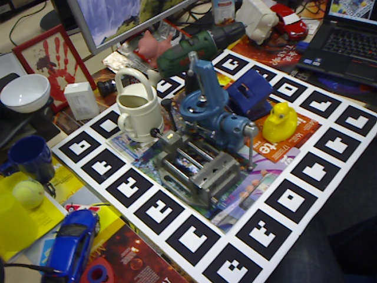
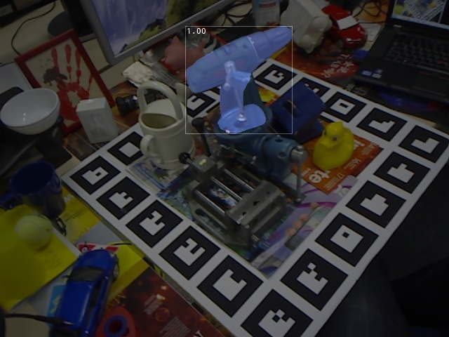

# ZebraPose

This branch is dedicated to verifying that ZebraPose is operational on Docker with WSL2 as of Dec 2024. For detailed information about ZebraPose itself, please refer to the [main branch](https://github.com/tsuyoshimishina/ZebraPose/tree/main).

## Prerequisites

To use this branch, ensure the following are set up on your system:

1. WSL2
2. Docker
3. NVIDIA Driver
4. NVIDIA Container Toolkit

## Setup Instructions

1. Download `docker/Dockerfile` from this repository.
2. Build the Docker image using the Dockerfile with the following command:

    ```bash
    docker build -t zebrapose .
    ```

3. Run the Docker container with the following command:

    ```bash
    docker run --rm --gpus all -it --name zebrapose zebrapose:latest bash
    ```
    (If you want to reuse the container for future runs, you can omit the `--rm` option.)

## Run Inference with Pretrained Model

After starting the container, execute the following commands in the bash shell:

```bash
cd ~/ZebraPose/zebrapose

# Test with the pretrained model
python test.py --cfg config/config_BOP/lmo/exp_lmo_BOP.txt --obj_name driller --ckpt_file checkpoints/pretrained_lmo_paper/driller --ignore_bit 0 --eval_output_path results/lmo/pretrained_paper/driller

# Merge the .csv file generated in the previous step
python tools_for_BOP/merge_csv.py --input_dir results/lmo/pretrained_paper/driller/pose_result_bop --output_fn ~/ZebraPose/zebrapose/results/zebrapose_lmo-test.csv

# Remove the leading BOM (Byte Order Mark) from the result file so that eval_bop19_pose.py can process it correctly
# (Eventually, we will modify merge_csv.py to save the result file without BOM)
sed -i '1s/^\xEF\xBB\xBF//' results/zebrapose_lmo-test.csv

cd ~/ZebraPose/bop_toolkit

# Evaluate and visualize the estimated poses
python scripts/eval_bop19_pose.py --renderer_type=vispy --result_filenames=zebrapose_lmo-test.csv --targets_filename=test_targets_bop19_obj8.json
python scripts/vis_est_poses.py
```

After running the commands above, you will have the following files and directories (along with bunch of others!):

- Pose Estimation Results:  
  `~/ZebraPose/zebrapose/results/zebrapose_lmo-test.csv`
- Pose Estimation Errors (e.g. $e_\text{MSSD}$):  
  `~/ZebraPose/zebrapose/eval/zebrapose_lmo-test/error=mssd_ntop=-1/errors_000002.json`
- Pose Estimation Result Images Directory:  
  `~/ZebraPose/zebrapose/visualizations/vis_est_poses/zebrapose_lmo-test/000002`

You can visually compare the result images to the test images located in `~/ZebraPose/zebrapose/bop_datasets/lmo/test/000002/rgb`, like below:

| Test image | Result image |
|----|----|
|  |  |